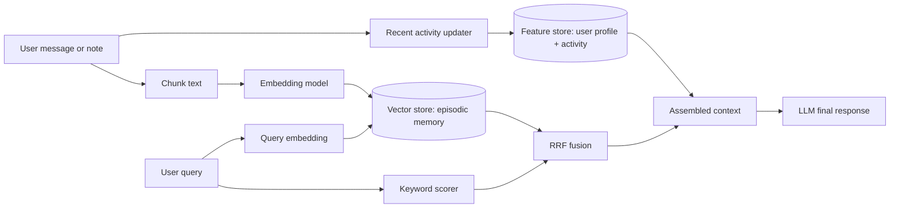

# Bonus Architecture - Hybrid Memory Agent

Contributors: solo submission.

## Goal

This POC designs a personal AI assistant for Vietnamese users. The assistant keeps two kinds of memory. Episodic memory stores conversations, notes, and documents the user has read; it changes often and is retrieved by meaning. Stable profile memory stores slower-moving user features such as preferred language, reading speed, topic affinity, and recent activity counters. The final assistant context is assembled from both: top memories from a vector store plus user features from a feature-store-like profile table.

## Decision 1: Chunking Strategy

I chose message-sized chunks with a soft cap of about 600 characters for the POC. A long note is split by sentence boundaries into compact chunks; short chat messages stay as one chunk. This is simpler than semantic chunking but still prevents one large document from dominating retrieval.

The tradeoff is retrieval quality versus storage cost and implementation complexity. Per-conversation chunks are cheap, but they hide small facts inside a large vector and waste context window space when recalled. Per-message chunks are precise and cheap to implement, but they can lose cross-message context. Full semantic chunking is better for long documents because related paragraphs stay together, but it needs an extra segmentation step and more testing. For a lab POC, message-sized chunks are the right default because the memory items are mostly notes and chat-like snippets.

For Vietnamese users, chunking must handle code-switching such as "toi dang doc Kubernetes autoscaling" and Vietnamese punctuation. I avoid relying on a heavy Vietnamese tokenizer in the POC; whitespace and punctuation splitting are enough for a minimal demo. In production, I would evaluate `underthesea` or `pyvi` for keyword indexing, while leaving dense embeddings to a multilingual model such as `bge-m3`.

## Decision 2: Feature Schema

I use a small tabular feature schema keyed by `user_id`: `preferred_language`, `reading_speed_wpm`, `topic_affinity`, `queries_last_hour`, and `recent_topics`. These features are stable enough to serve quickly and explainably. The recall output can say, for example, "user prefers vi, reads about cloud, and asked 4 queries recently."

The tradeoff is tabular features versus embedding features. Embedding a user's entire preference history can capture subtle taste, but it is harder to inspect, harder to refresh safely, and easier to leak sensitive history. Tabular features are less expressive, but they are transparent, cheap to materialize, and easy to use for deterministic re-ranking. For this lab, tabular features match Feast's strengths: entity keys, TTL, online lookup, and point-in-time correctness.

The feature store should not hold raw episodic memories. I considered storing memories as an embedding feature view, but rejected it because episodic memory has a different lifecycle. New notes may arrive every minute and need nearest-neighbor search; profile features change daily or hourly and need low-latency key-value lookup. Keeping these stores separate avoids forcing one storage model to do two jobs poorly.

## Decision 3: Freshness Strategy

The POC updates recent activity immediately in memory when `recall()` is called. In a real system I would use three freshness tiers. For active chat personalization, `queries_last_hour` should update in seconds through streaming or a push API. For document ingestion, new episodic chunks should be searchable within seconds or one minute, because the user may ask about a note they just saved. For stable profile fields such as reading speed or topic affinity, a 5-minute to daily batch refresh is acceptable.

The tradeoff is freshness versus cost and operational risk. Sub-second streaming makes the assistant feel alive, but it adds queues, retries, and backpressure. Five-minute refresh is cheaper and reliable, but it can disappoint a user who expects the assistant to remember a document immediately. Daily refresh is fine for slow preferences, but wrong for recent intent. The design therefore separates recent activity from stable profile features.

## Vietnamese Context

Vietnamese users often mix Vietnamese and English technical terms: "cloud security", "Kubernetes", "autoscaling", "phap ly du lieu". A pure English BM25 tokenizer can miss accent variants and phonetic typos, while a pure Vietnamese tokenizer can split technical English awkwardly. Hybrid retrieval is useful here because lexical search catches exact product terms and vector search catches paraphrases such as "tu dong mo rong ha tang" for autoscaling.

Privacy also matters. Personal memory can contain health, legal, finance, or workplace information. A production version needs per-user filtering in the vector store, encrypted storage, deletion APIs, and audit logs. This POC uses a `user_id` payload filter to demonstrate isolation, but it does not implement encryption or retention policies.

## What This POC Does Not Handle Yet

The POC does not call a real LLM; it only returns the assembled context that would be passed to one. It does not implement memory deletion, encryption at rest, multi-device sync, streaming ingestion, or production observability. It also uses a small local embedding model for laptop friendliness. The core architecture is still valid: vector store for episodic recall, feature store for stable profile and recent activity, and RRF-style fusion for robust mixed Vietnamese/English queries.
